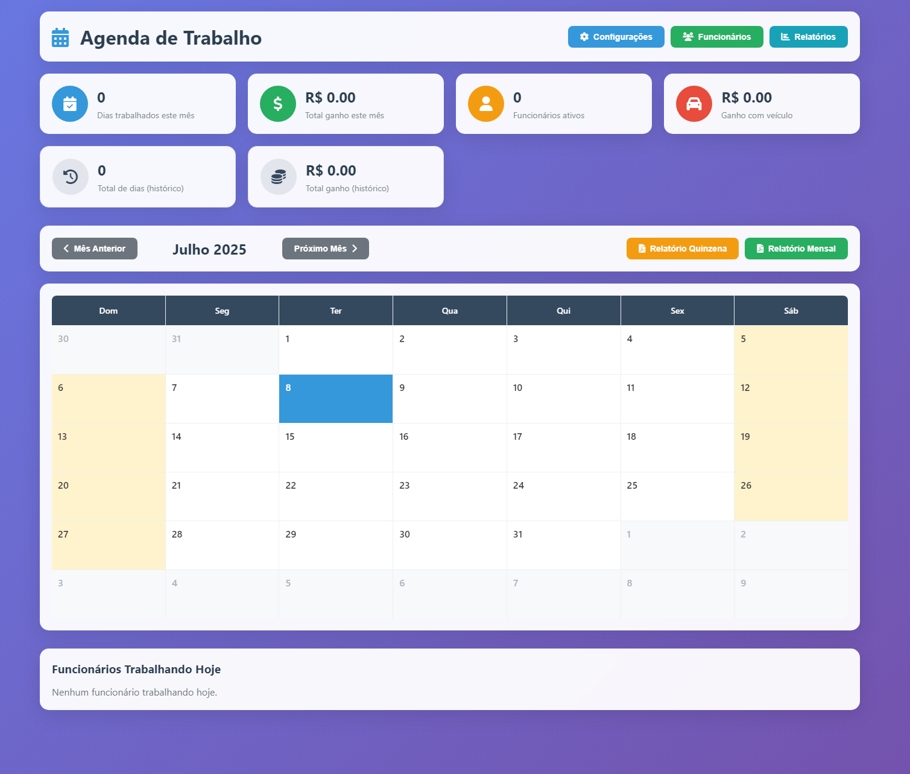

# 📅 Agenda Inteligente

Um sistema desktop moderno e intuitivo para gerenciamento de funcionários e controle de diárias de trabalho, desenvolvido com Electron.



## 🚀 Características Principais

- **Gestão de Funcionários**: Cadastro, edição e exclusão de funcionários
- **Controle de Diárias**: Registro e acompanhamento de dias trabalhados
- **Relatórios Detalhados**: Geração de relatórios em PDF
- **Interface Moderna**: Design responsivo e intuitivo
- **Banco de Dados Local**: Armazenamento seguro com SQLite
- **Multiplataforma**: Funciona no Windows, macOS e Linux

## 🛠️ Tecnologias Utilizadas

- **[Electron](https://electronjs.org/)** - Framework para aplicações desktop
- **[SQLite3](https://www.sqlite.org/)** - Banco de dados local
- **[jsPDF](https://github.com/parallax/jsPDF)** - Geração de relatórios PDF
- **HTML5/CSS3/JavaScript** - Interface do usuário
- **Font Awesome** - Ícones

## 📋 Pré-requisitos

Antes de começar, certifique-se de ter instalado:

- [Node.js](https://nodejs.org/) (versão 16 ou superior)
- [npm](https://www.npmjs.com/) (geralmente vem com o Node.js)

## ⚡ Instalação

1. **Clone o repositório**
   ```bash
   git clone https://github.com/seu-usuario/AgendaInteligente.git
   cd AgendaInteligente
   ```

2. **Instale as dependências**
   ```bash
   npm install
   ```

3. **Execute a aplicação**
   ```bash
   npm start
   ```

## 🔧 Scripts Disponíveis

| Script | Descrição |
|--------|-----------|
| `npm start` | Executa a aplicação em modo desenvolvimento |
| `npm run build` | Constrói a aplicação para produção |
| `npm run dist` | Gera o executável para Windows |

## 📖 Como Usar

### 1. **Gerenciamento de Funcionários**
- Acesse a seção "Funcionários" no cabeçalho
- Cadastre novos funcionários com informações básicas
- Edite ou remova funcionários existentes

### 2. **Registro de Diárias**
- Selecione o funcionário na tela principal
- Registre os dias trabalhados
- Acompanhe o total de diárias por período

### 3. **Geração de Relatórios**
- Acesse a seção "Relatórios"
- Selecione o período desejado
- Gere relatórios em PDF com detalhes completos

### 4. **Configurações**
- Ajuste preferências do sistema
- Configure parâmetros de relatórios
- Personalize a interface

## 🏗️ Estrutura do Projeto

```
AgendaInteligente/
├── 📁 screenshots/          # Capturas de tela
├── 📄 main.js              # Processo principal do Electron
├── 📄 renderer.js          # Lógica da interface
├── 📄 database.js          # Configuração do banco SQLite
├── 📄 index.html           # Interface principal
├── 📄 style.css            # Estilos principais
├── 📄 style_fix.css        # Correções de estilo
├── 📄 package.json         # Configurações do projeto
├── 📄 limpar-banco.js      # Utilitário para limpar banco
└── 📄 agenda.png           # Ícone da aplicação
```

## 💾 Banco de Dados

A aplicação utiliza SQLite para armazenamento local dos dados:

- **Tabela Funcionários**: Informações pessoais e profissionais
- **Tabela Diárias**: Registro de dias trabalhados
- **Configurações**: Preferências do sistema

## 🔐 Segurança

- Dados armazenados localmente
- Sem conexão com servidores externos
- Backup automático do banco de dados
- Validação de entrada de dados

## 🐛 Solução de Problemas

### Erro ao iniciar a aplicação
```bash
# Limpe o cache e reinstale
rm -rf node_modules package-lock.json
npm install
npm start
```

### Problemas com o banco de dados
```bash
# Execute o script de limpeza
node limpar-banco.js
```

## 🤝 Contribuindo

1. Faça um fork do projeto
2. Crie uma branch para sua feature (`git checkout -b feature/AmazingFeature`)
3. Commit suas mudanças (`git commit -m 'Add some AmazingFeature'`)
4. Push para a branch (`git push origin feature/AmazingFeature`)
5. Abra um Pull Request

## 📝 Licença

Este projeto está sob a licença MIT. Veja o arquivo [LICENSE](LICENSE) para mais detalhes.

## 👨‍💻 Autor

**Igor Gustavo**
- 💼 LinkedIn: [(https://www.linkedin.com/in/igor-gustavo-4573b0294/)]

---

<div align="center">
  <strong>⭐ Se este projeto te ajudou, não esqueça de dar uma estrela! ⭐</strong>
</div>
